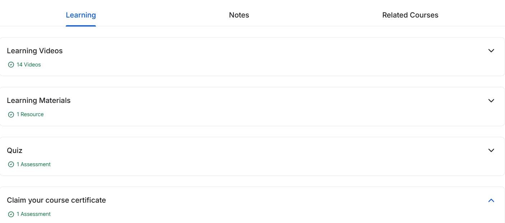

# 🛡️ Introduction to Firewall  

  
  
  
  
  

This repository contains **notes, labs, cheatsheets, case studies, and certificate of completion** for the *Introduction to Firewall* course.  
The course provides a strong foundation in **firewall concepts, deployment, rule configuration, monitoring, and best practices**.  

---

## 📚 Notes  

| File | Description |
|------|-------------|
| [`01-introduction.md`](./notes/01-introduction.md) | Introduction to firewalls |
| [`02-firewall-types.md`](./notes/02-firewall-types.md) | Types of firewalls |
| [`03-firewall-deployment.md`](./notes/03-firewall-deployment.md) | Deployment strategies |
| [`04-firewall-rules.md`](./notes/04-firewall-rules.md) | Rules & policies |
| [`05-packet-filtering.md`](./notes/05-packet-filtering.md) | Packet filtering & stateful inspection |
| [`06-nat-firewall.md`](./notes/06-nat-firewall.md) | NAT & firewall |
| [`07-logging-monitoring.md`](./notes/07-logging-monitoring.md) | Logging & monitoring |

---

## 🧪 Labs  

| File | Description |
|------|-------------|
| [`firewall-basic-setup.md`](./labs/firewall-basic-setup.md) | Setting up a basic firewall |
| [`firewall-rule-examples.md`](./labs/firewall-rule-examples.md) | Example rules & ACLs |
| [`hands-on-exercises.md`](./labs/hands-on-exercises.md) | Practical exercises |

---

## 📑 Cheatsheets  

| File | Description |
|------|-------------|
| [`firewall-commands.md`](./cheatsheets/firewall-commands.md) | Common firewall commands |
| [`best-practices.md`](./cheatsheets/best-practices.md) | Firewall best practices |

---

## 🔬 Case Studies & Extras  

| File | Description |
|------|-------------|
| [`case-studies.md`](./extras/case-studies.md) | Analyzed firewall scenarios |
| [`resources.md`](./extras/resources.md) | References & external links |
| [`timeline.md`](./extras/timeline.md) | Suggested learning timeline |

---

## 📖 Docs  

| File | Description |
|------|-------------|
| [`glossary.md`](./docs/glossary.md) | Firewall & network security glossary |
| [`index.md`](./docs/index.md) | Course overview |
| [`references.md`](./docs/references.md) | References & external sources |
| [`roadmap.md`](./docs/roadmap.md) | Learning roadmap |
| [`syllabus.md`](./docs/syllabus.md) | Course syllabus |

---

## 📸 Screenshots  

| Step | Screenshot |
|------|------------|
| Learning Overview |  |

---

## 📜 Certificate  

🎓 [`Introduction to Firewall`](./cert/Introduction%20to%20Firewall.jpg)  

---

## 📝 Personal Review  

This course gave me a comprehensive understanding of **firewall concepts and deployment**.  
The **labs on rule configuration and logging** provided hands-on experience in securing networks.  
I particularly appreciated the **cheatsheets**, which made referencing commands and best practices quick and efficient.  

Overall, this repository serves as a **complete guide for anyone starting with firewalls in network security**.  

---

## ✍️ Author  

**Thành Danh** – Red Team Learner & Security Researcher  

- GitHub: [@ngvuthdanhh](https://github.com/ngvuthdanhh)  
- Email: ngvu.thdanh@gmail.com  

---

## 📄 License  

This project is licensed under the **MIT License**.  
See [`LICENSE`](./LICENSE) for full details.  

© 2025 ngvuthdanhh. All rights reserved.  
